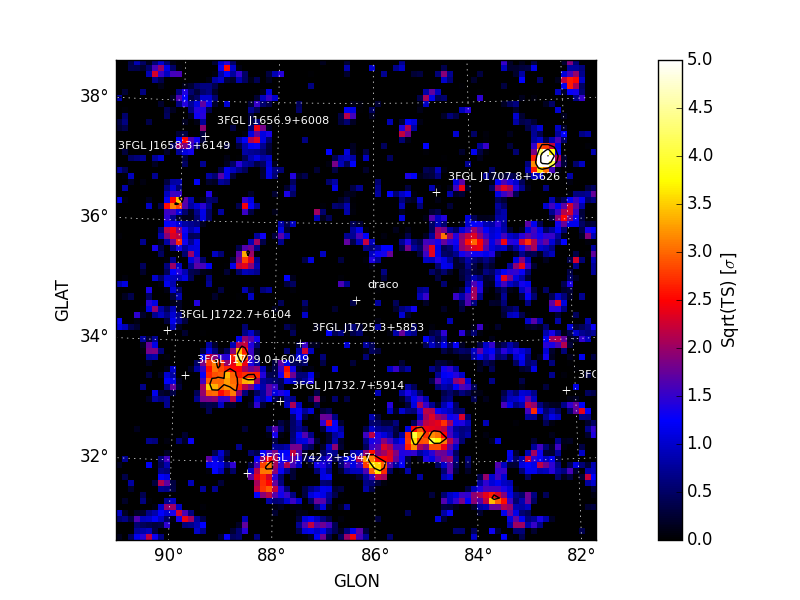

.. _detection:

##################################
Source Detection
##################################

fermipy provides several methods for source detection that can be used
to look for unmodeled sources as well as evaluate the fit quality of
the model.  These methods are

* :ref:`tsmap`: :py:meth:`~fermipy.gtanalysis.GTAnalysis.tsmap` generates a test
  statistic (TS) map for a new source centered at each spatial bin in
  the ROI.

* :ref:`tscube`: :py:meth:`~fermipy.gtanalysis.GTAnalysis.tscube` generates a TS map
  using the `gttscube` ST application.  In addition to the TS map this
  method can also extract the likelihood profile as a function of
  energy and position over the whole ROI.

* :ref:`residmap`: :py:meth:`~fermipy.gtanalysis.GTAnalysis.residmap` generates a
  residual map by evaluating the difference between smoothed data and
  model maps (residual) at each spatial bin in the ROI.

* :ref:`findsources`:
  :py:meth:`~fermipy.gtanalysis.GTAnalysis.find_sources` is an iterative
  source-finding algorithim that adds new sources to the ROI by
  looking for peaks in the TS map.

Additional information about using each of these method is provided in
the sections below.

.. _tsmap:

TS Map
======

:py:meth:`~fermipy.gtanalysis.GTAnalysis.tsmap` performs a likelihood
ratio test for an additional source at the center of each spatial bin
of the ROI.  The basic approach is similar to that of the `gttsmap` ST
application.  For each spatial bin the method calculates the maximum
likelihood test statistic given by

.. math::

   \mathrm{TS} = 2 \sum_{k} \ln L(\mu,\theta|n_{k}) - \ln L(0,\theta|n_{k})

where the summation index *k* runs over both spatial and energy bins,
μ is the test source normalization parameter, and θ represents the
parameters of the background model.  Unlike `gttsmap`, the likelihood
fitting implementation used by
:py:meth:`~fermipy.gtanalysis.GTAnalysis.tsmap` only fits for the
normalization of the test source and does not re-fit parameters of the
background model.  The properties of the test source (spectrum and
spatial morphology) are controlled with the `model` dictionary
argument which follows the conventions as
:py:meth:`~fermipy.gtanalysis.GTAnalysis.add_source`.

.. code-block:: python
   
   # Generate TS map for a power-law point source with Index=2.0
   model = {'Index' : 2.0, 'SpatialModel' : 'PointSource'}
   maps = gta.tsmap('fit1',model=model)

   # Generate TS map for a power-law point source with Index=2.0 and
   # restricting the analysis to E > 3.16 GeV
   model = {'Index' : 2.0, 'SpatialModel' : 'PointSource'}
   maps = gta.tsmap('fit1_emin35',model=model,erange=[3.5,None])

   # Generate TS maps for a power-law point source with Index=1.5, 2.0, and 2.5
   model={'SpatialModel' : 'PointSource'}
   maps = []
   for index in [1.5,2.0,2.5]:
       model['Index'] = index
       maps += [gta.tsmap('fit1',model=model)]

:py:meth:`~fermipy.gtanalysis.GTAnalysis.tsmap` returns a `maps`
dictionary containing `~fermipy.utils.Map` representations of the TS
and NPred of the best-fit test source at each position.

.. code-block:: python
   
   >>> model = {'Index' : 2.0, 'SpatialModel' : 'PointSource'}
   >>> maps = gta.tsmap('fit1',model=model)
   >>> print(maps.keys())
   {u'amplitude': <fermipy.utils.Map object at 0x113fe8ed0>,
    u'files': {u'amplitude': u'fit1_pointsource_powerlaw_2.00_tsmap_amplitude.fits',
               u'npred': u'fit1_pointsource_powerlaw_2.00_tsmap_npred.fits',
               u'sqrt_ts': u'fit1_pointsource_powerlaw_2.00_tsmap_sqrt_ts.fits',
               u'ts': u'fit1_pointsource_powerlaw_2.00_tsmap_ts.fits'},
    u'name': u'fit1_pointsource_powerlaw_2.00',
    u'npred': <fermipy.utils.Map object at 0x113fe8e90>,
    u'sqrt_ts': <fermipy.utils.Map object at 0x113fe8e50>,
    u'src_dict': {u'Index': 2.0,
                  u'Prefactor': 1e-13,
                  u'SpatialModel': u'PointSource',
                  u'SpatialWidth': 0.3,
                  u'dec': 57.86229494576997,
                  'name': u'tsmap_testsource',
                  u'ra': 259.96358082772394},
    u'ts': <fermipy.utils.Map object at 0x113fe8dd0>}]

The contents of the output dictionary are documented below:

============= ====================== =================================================================
Key           Type                   Description
============= ====================== =================================================================
amplitude     `~fermipy.utils.Map`   Best-fit test source amplitude
                                     expressed in terms of the spectral prefactor.
npred         `~fermipy.utils.Map`   Best-fit test source amplitude
                                     expressed in terms of the total model counts (Npred).
ts            `~fermipy.utils.Map`   Test source TS (twice the logLike difference between null and
	                             alternate hypothese).
sqrt_ts       `~fermipy.utils.Map`   Square-root of the test source TS.
files         dict                   Dictionary containing the file path of the FITS
                                     image files generated by this method. 
src_dict      dict                   Dictionary defining the properties of the test source.
============= ====================== =================================================================

Results are also written as FITS and rendered image files to the
analysis working directory.  All output files are prepended with the
`prefix` argument.  Example image files for `sqrt_ts` and `npred` are
shown below.  Isocontours of sqrt(TS) are plotted at 3, 5, 7, and 9
sigma.

   

+---------------------------------+---------------------------------+
| Sqrt(TS)                        | NPred                           |
+=================================+=================================+
| |image0|                        | |image1|                        |
+---------------------------------+---------------------------------+

Reference/API
-------------

.. automethod:: fermipy.gtanalysis.GTAnalysis.tsmap
   :noindex:

.. _residmap:

Residual Map
============

:py:meth:`~fermipy.gtanalysis.GTAnalysis.residmap` calculates the
residual between smoothed data and model maps.  Whereas
:py:meth:`~fermipy.gtanalysis.GTAnalysis.tsmap` fits only for positive
excesses with respect to the baseline model,
:py:meth:`~fermipy.gtanalysis.GTAnalysis.residmap` is sensitive to
both positive and negative residuals and can be useful for assessing
the model goodness-of-fit.  The significance of the data/model
residual at map position (*i*, *j*) is given by

.. math::

   \sigma_{ij}^2 = 2 \mathrm{sgn}(\tilde{n}_{ij} - \tilde{m}_{ij}) 
   \left(\ln L_{P}(\tilde{n}_{ij},\tilde{n}_{ij}) - \ln L_{P}(\tilde{n}_{ij},\tilde{m}_{ij})\right)

   \mathrm{with} \quad
   \tilde{m}_{ij} = (m \ast k)_{ij} \quad \tilde{n}_{ij} = (n \ast k)_{ij}
   \ln L_{P}(n,m) = n\ln(m) - m

where *n* and *m* are the data and model maps and *k* is the
convolution kernel.  The spatial and spectral properties of the
convolution kernel are defined with the `model` argument.  All source
models are supported as well as a gaussian kernel (defined by setting
*SpatialModel* to *Gaussian*).

.. code-block:: python
   
   # Generate residual map for a Gaussian kernel with Index=2.0
   model = {'Index' : 2.0, 
            'SpatialModel' : 'Gaussian', 'SpatialWidth' : 0.3 }
   maps = gta.residmap('fit1',model=model)

   # Generate TS map for a power-law point source with Index=2.0 for
   # E > 3.16 GeV
   model = {'Index' : 2.0, 'SpatialModel' : 'PointSource'}
   maps = gta.residmap('fit1_emin35',model=model,erange=[3.5,None])

   # Generate TS maps for a power-law point source with Index=1.5, 2.0, and 2.5
   model={'SpatialModel' : 'PointSource'}
   maps = []
   for index in [1.5,2.0,2.5]:
       model['Index'] = index
       maps += [gta.residmap('fit1',model=model)]

:py:meth:`~fermipy.gtanalysis.GTAnalysis.residmap` returns a `maps`
dictionary containing `~fermipy.utils.Map` representations of the 
residual signifiance and amplitude as well as the smoothed data and
model maps.

============= ====================== ======================================
Key           Type                   Description
============= ====================== ======================================
amplitude     `~fermipy.utils.Map`   Residual significance in sigma.
excess        `~fermipy.utils.Map`   Residual amplitude in counts.
data          `~fermipy.utils.Map`   Smoothed counts map.
model         `~fermipy.utils.Map`   Smoothed model map.
files         dict                   File paths of the FITS image
                                     files generated by this method. 
src_dict      dict                   Source dictionary with the
                                     properties of the convolution kernel. 
============= ====================== ======================================

.. |image2| image:: residmap_gaussian_sigma.png
   :width: 100%
   
.. |image3| image:: residmap_gaussian_excess.png
   :width: 100%

+------------------------+------------------------+
| Sigma                  | Excess Counts          |
+========================+========================+
| |image2|               + |image3|               |
+------------------------+------------------------+

Reference/API
-------------

.. automethod:: fermipy.gtanalysis.GTAnalysis.residmap
   :noindex:

.. _tscube:

TS Cube
=======

.. warning:: 

   The TS cube method is experimental and is not supported
   by the current public release of the Fermi STs.  

.. automethod:: fermipy.gtanalysis.GTAnalysis.tscube
   :noindex:

.. _findsources:

Source Finding
==============

.. automethod:: fermipy.gtanalysis.GTAnalysis.find_sources
   :noindex:
