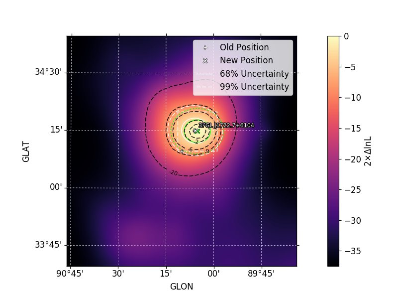
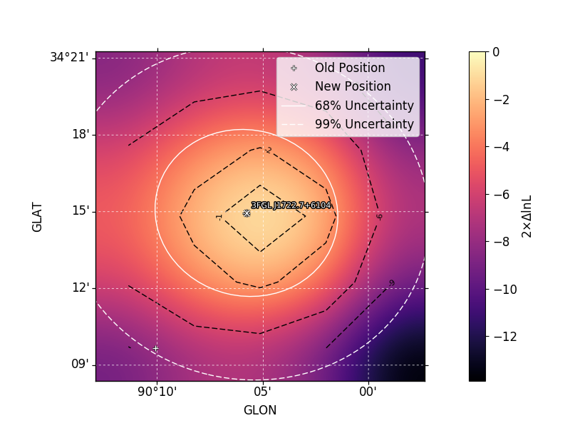

.. _localization:

Source Localization
===================

The :py:meth:`~fermipy.gtanalysis.GTAnalysis.localize` method can be
used to spatially localize a source.  Localization is performed by
scanning the likelihood surface in source position in a local patch
around the nominal source position.  The fit to the source position
proceeds in two iterations:

* **TS Map Scan**: Obtain a first estimate of the source position by
  generating a likelihood map of the region using the
  `~fermipy.gtanalysis.GTAnalysis.tsmap` method.  In this step all
  background parameters are fixed to their nominal values.  The size
  of the search region used for this step is set with the
  ``dtheta_max`` parameter.

* **Likelihood Scan**: Refine the position of the source by performing a
  scan of the likelihood surface in a box centered on the best-fit
  position found in the first iteration.  The size of the search
  region is set to encompass the 99% positional uncertainty contour.
  This method uses a full likelihood fit at each point in the
  likelihood scan and will re-fit all free parameters of the model.

If a peak is found in the search region and the positional fit
succeeds, the method will update the position of the source in the
model to the new best-fit position.  
  
Examples
--------
  
The localization method is executed by passing the name of a source as
its argument.  The method returns a python dictionary with the
best-fit source position and localization errors and also saves the same
information to FITS and numpy files.

.. code-block:: python
   
   >>> loc = gta.localize('3FGL J1722.7+6104', make_plots=True)
   >>> print(loc['ra'],loc['dec'],loc['pos_r68'],loc['pos_r95'])
   (260.53164555483784, 61.04493807148745, 0.14384100879403075, 0.23213050350030126)

When running with ``make_plots=True`` the method will save a
diagnostic plot to the working directory with a visualization of the
localization contours.  The green and white contours show the
uncertainty ellipse derived from the first and second iterations of
the positional scan.

   

.. csv-table::
   :header: First Iteration, Second Iteration
   :widths: 50, 50
           
   |image_loc|, |image_loc_peak|

The default configuration for the localization analysis can be
overriden by supplying one or more *kwargs*:
   
.. code-block:: python
   
   # Localize the source and update its properties in the model
   # with the localized position
   >>> o = gta.extension('3FGL J1722.7+6104', update=True)

By default all background parameters will be fixed when the positional
fit is performed.  One can choose to free background parameters with
the ``free_background`` and ``free_radius`` options:

.. code-block:: python
   
   # Free a nearby source that may be be partially degenerate with the
   # source of interest
   gta.free_norm('sourceB')
   gta.localize('3FGL J1722.7+6104', free_background=True)

   # Free normalizations of background sources within a certain
   # distance of the source of interest
   gta.localize('3FGL J1722.7+6104', free_radius=1.0)
   
The contents of the output dictionary are described in the following table:

.. csv-table:: *localize* Output
   :header:    Key, Type, Description
   :file: ../config/localize_output.csv
   :delim: tab
   :widths: 10,10,80

Configuration
-------------

.. csv-table:: *localize* Options
   :header:    Option, Default, Description
   :file: ../config/localize.csv
   :delim: tab
   :widths: 10,10,80

            
Reference/API
-------------

.. automethod:: fermipy.gtanalysis.GTAnalysis.localize
   :noindex:

