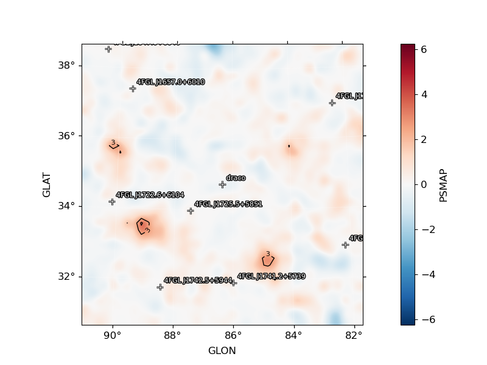
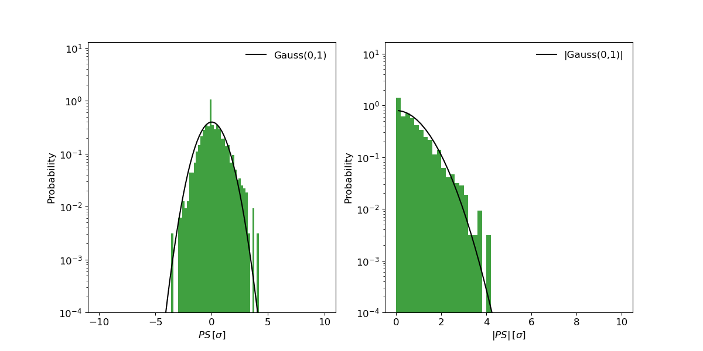

.. _psmap:

PS Map
======

:py:meth:`~fermipy.gtanalysis.GTAnalysis.psmap` quantifies the 3d data/model agreement by computing the PS
at each spatial bin in the ROI according to the algorithm described in Bruel P. (2021), A&A, 656, A81.
(`doi:10.1051/0004-6361/202141553 <https://arxiv.org/pdf/2109.07443.pdf>`_). For each spatial bin, the algorithm first computes
the data and model count spectra integrated over an energy dependent region (following the PSF energy dependence)
and then computes the p-value that the data count spectrum is compatible with the model count spectrum (using the likelihood statistics).
The absolute value of PS is -log10(p-value) and its sign corresponds to the sign of the sum over the spectrum of the residuals in sigma.
The algorithm also provides a PS map in sigma units.

Examples
--------

In order to run psmap, the user must first compute the source model map using the :py:meth:`~fermipy.gtanalysis.GTAnalysis.write_model_map'
function specifying the name of the model with the parameter ``model_name``.
The :py:meth:`~fermipy.gtanalysis.GTAnalysis.psmap` will then be called, specifying the data and model 3d map files, as well as the energy binning
(with the arguments ``emin``, ``emax`` and ``nbinloge``). It is recommended to set ``nbinloge`` so that the logE bin width is between 0.2 and 0.3.

.. code-block:: python
   
   # Write the source model map (after performing the fit)
   gta.write_model_map(model_name="model01")

   # Generate the PS map
   psmap = gta.psmap(cmap='ccube_00.fits',mmap='mcube_model01_00.fits', make_plots=True, emin=100, emax=100000, nbinloge=15)

In the case of an analysis with multiple components, the user has to provide the list of data and model files (separated by colons) corresponding to the components that the user wants to include in the PS computation:

.. code-block:: python
   
   # Write the source model map (after performing the fit)
   gta.write_model_map(model_name="model01")

   # Generate the PS map using the first three components
   psmap = gta.psmap(cmap='ccube_00.fits:ccube_01.fits:ccube_02.fits',mmap='mcube_model01_00.fits:mcube_model01_01.fits:mcube_model01_02.fits', make_plots=True, emin=100, emax=100000, nbinloge=15)

Configuration
-------------

The default configuration of the method is controlled with the
:ref:`config_psmap` section of the configuration file.  The default
configuration can be overriden by passing the option as a *kwargs*
argument to the method.

If the analysis uses likelihood weights, the user can specify the likelihood weight file with the argument ``wmap``.

The user can set the parameters defining the energy dependent region used in the count spectrum integration step.
The integration radius is defined by the function sqrt(psfpar0^2*pow(E/psfpar1,-2*psfpar2) + psfpar3^2), with E in MeV.
The default parameters (``psfpar0``=4.0,``psfpar1``=100,``psfpar2``=0.9,``psfpar3``=0.1) are optimized to look for point-source like deviations.
When looking for extended deviations (~1deg scale), it is recommended to use (``psfpar0``=5.0,``psfpar1``=100,``psfpar2``=0.8,``psfpar3``=1.0).
In the case of a multiple component analysis, it is possible to use the argument ``psfpar0lst`` to provide the list of psfpar0 of each component (separated by colons).

.. csv-table:: *psmap* Options
   :header:    Option, Default, Description
   :file: ../config/psmap.csv
   :delim: tab
   :widths: 10,10,80

Output
------

:py:meth:`~fermipy.gtanalysis.GTAnalysis.psmap` returns a dictionary containing the following variables:

============= ====================== =================================================================
Key           Type                   Description
============= ====================== =================================================================
psmax         float                  maximum of the ps map
psmaxsigma    float                  maximum of the ps map in sigma units
coordname1    str                    Name of the coordinate of the ps maximum
coordname2    str                    Name of the coordinaste of the ps maximum
coordx        float                  Value of the X coordinate of the ps maximum
coordy        float                  Value of the Y coordinate of the ps maximum
ipix          int                    Value of the i pixel of the of the ps maximum
jpix          int                    Value of the j pixel of the of the ps maximum
wcs2d         WCS Keywords           WCS of the ps map
psmap         np.array               PSMAP
psmapsigma    np.array               PSMAP in sigma units
name          str                    NAmke of the model
ps_map        `~fermipy.skymap.Map`  WcsNDMap PSMAP
pssigma_map   `~fermipy.skymap.Map`  WcsNDMap PSMAP in sigma units
config        dict                   Dictionary of the input configuration
file          str                    Name of the output file
file_name     str                    Full path of the output file
============= ====================== =================================================================

The ``write_fits`` option can used to write the output to a FITS or numpy file. The value of the maximum of the PS map
can be retrieved from the output dictionary:

.. code-block:: python

   print('PS maximum value=%.2f sigma, at %s=%.2f, %s=%.2f' %(psmap['psmaxsigma'],
                                                     psmap['coordname1'],float(psmap['coordx']),
                                                     psmap['coordname2'],float(psmap['coordy'])))

   Maximum PSvalue=3.80 sigma, at GLON-AIT=86.75, GLAT-AIT=38.62

Diagnostic plots can be generated by setting ``make_plots=True`` or by
passing the output dictionary to `~fermipy.plotting.AnalysisPlotter.make_psmap_plots`:

.. code-block:: python

   gta.write_model_map(model_name="model01")
   psmap = gta.psmap(cmap='ccube_00.fits',mmap='mcube_model01_00.fits', make_plots=True)
   //equivalent to:
   gta.plotter.make_tsmap_plots(psmap, roi=gta.roi)

This will generate the following plots:

* ``image_psmap`` : Map of PS values.  The color map is truncated at
  5 sigma with isocontours at 2.57,4.20,6.24 (corresponding to 3,4,5 sigma) indicating values
  above this threshold.

* ``image_psmap_sigma`` : Map of PS values converted in sigma. The color map is truncated at
  5 sigma with isocontours at 3,4,5 indicating values
  above this threshold.
  
* ``image_ps_hist`` : Left: Histogram of PS (in sigma) for all points in the
  map. Superimposed is the reference distribution for a gaussian with mean 0 and sigma=1.
  Right: Histogram of the absolute value of PS (in sigma) for all points in the
  map. Superimposed is the reference distribution for the absolute value of a gaussian with mean 0 and sigma=1.
  It must be noted that, because the PS computation parameters are set to provide a good precision for low probability
  deviations and because of the sign assignment method, the central part of the PS distribution likely has a notch
  around zero. This notch is much less visible in the distribution of the absolute value of PS. What is
  really interesting in terms of significant deviation is the distribution for PS above 2 sigma.
   

   
.. |image_psmap_sigma| image:: testpsmap_psmap_sigma.png
   :width: 100%

.. csv-table::
   :header: PS Map, PS [Sigma] Map, PS [Sigma] Histogram
   :widths: 33, 33, 33

   |image_psmap|, |image_psmap_sigma|, |image_ps_hist_sigma|
           

Reference/API
-------------

.. automethod:: fermipy.gtanalysis.GTAnalysis.psmap
   :noindex:
