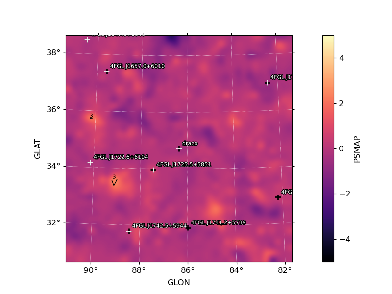
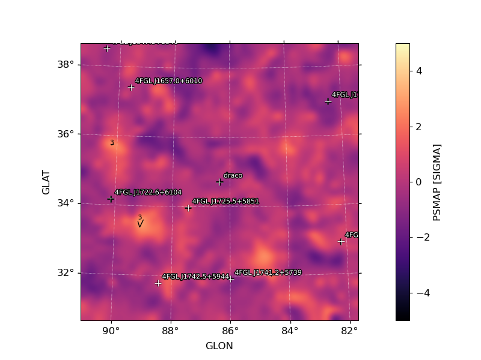
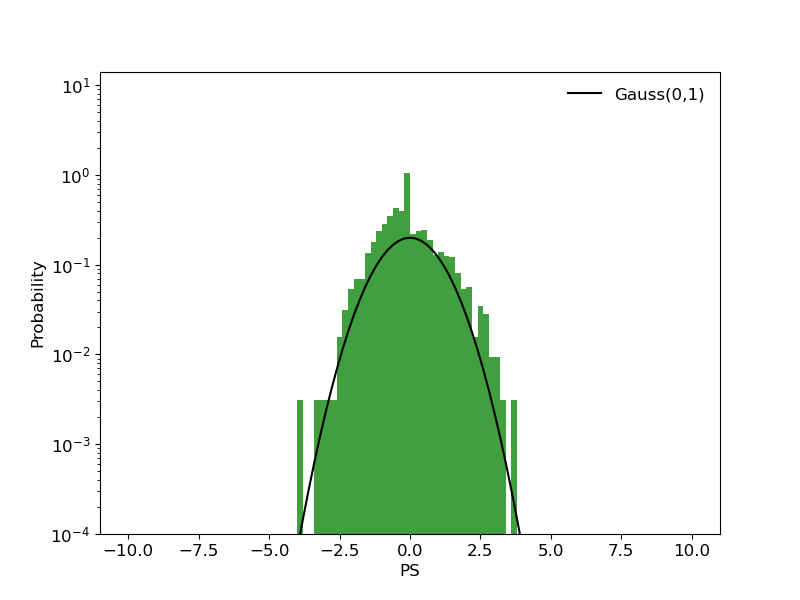

.. _psmap:

PS Map
======

:py:meth:`~fermipy.gtanalysis.GTAnalysis.psmap` generates a PS map for an additional source component centered at each
spatial bin in the ROI.  The PSmap algorithm is described in detail in Bruel P. (2021), A&A, 656, A81. (`doi:10.1051/0004-6361/202141553 <https://arxiv.org/pdf/2109.07443.pdf>`_).

For each spatial bin the method calculates the maximum likelihood test
statistic given by

.. math::

   \mathrm{TS} = 2 \sum_{k} \ln L(\mu,\theta|n_{k}) - \ln L(0,\theta|n_{k})

where the summation index *k* runs over both spatial and energy bins,
μ is the test source normalization parameter, and θ represents the
parameters of the background model.  The likelihood fitting
implementation used by :py:meth:`~fermipy.gtanalysis.GTAnalysis.psmap`
only fits the test source normalization (μ).  Shape parameters of the
test source and parameters of background components are fixed to their
current values.

Examples
--------

The spatial and spectral properties of the convolution kernel are
defined with the ``model`` dictionary argument.  The ``model``
dictionary format is the same as accepted by
:py:meth:`~fermipy.gtanalysis.GTAnalysis.add_source`.

.. code-block:: python
   
   # Generate TS map for a power-law point source with Index=2.0
   model = {'Index' : 2.0, 'SpatialModel' : 'PointSource'}
   maps = gta.tsmap('fit1',model=model)

   # Generate TS map for a power-law point source with Index=2.0 and
   # restricting the analysis to E > 3.16 GeV
   model = {'Index' : 2.0, 'SpatialModel' : 'PointSource'}
   maps = gta.tsmap('fit1_emin35',model=model,erange=[3.5,None])

   # Generate TS maps for a power-law point source with Index=1.5, 2.0, and 2.5
   model={'SpatialModel' : 'PointSource'}
   maps = []
   for index in [1.5,2.0,2.5]:
       model['Index'] = index
       maps += [gta.tsmap('fit1',model=model)]

The ``multithread`` option can be enabled to split the calculation
across all available cores:
       
.. code-block:: python
                
   maps = gta.tsmap('fit1',model=model,multithread=True)

Note that care should be taken when using this option in an
environment where the number of cores per process is restricted such
as a batch farm.

:py:meth:`~fermipy.gtanalysis.GTAnalysis.tsmap` returns a ``maps``
dictionary containing `~fermipy.skymap.Map` representations of the TS
and predicted counts (NPred) of the best-fit test source at each position.

.. code-block:: python
   
   model = {'Index' : 2.0, 'SpatialModel' : 'PointSource'}
   maps = gta.tsmap('fit1',model=model)   
   print('TS at Pixel (50,50): ',maps['ts'].counts[50,50])
   
The contents of the output dictionary are given in the following table.

============= ====================== =================================================================
Key           Type                   Description
============= ====================== =================================================================
amplitude     `~fermipy.skymap.Map`  Best-fit test source amplitude
                                     expressed in terms of the spectral prefactor.
npred         `~fermipy.skymap.Map`  Best-fit test source amplitude
                                     expressed in terms of the total model counts (Npred).
ts            `~fermipy.skymap.Map`  Test source TS (twice the logLike difference between null and
	                             alternate hypothese).
sqrt_ts       `~fermipy.skymap.Map`  Square-root of the test source TS.
file          str                    Path to a FITS file containing the maps (TS, etc.) generated by
                                     this method. 
src_dict      dict                   Dictionary defining the properties of the test source.
============= ====================== =================================================================

The ``write_fits`` and ``write_npy`` options can used to write the
output to a FITS or numpy file.  All output files are prepended with
the `prefix` argument.

Diagnostic plots can be generated by setting ``make_plots=True`` or by
passing the output dictionary to
`~fermipy.plotting.AnalysisPlotter.make_residmap_plots`:

.. code-block:: python
   
   maps = gta.tsmap('fit1',model=model, make_plots=True)
   gta.plotter.make_tsmap_plots(maps, roi=gta.roi)

This will generate the following plots:

* ``tsmap_sqrt_ts`` : Map of sqrt(TS) values.  The color map is truncated at
  5 sigma with isocontours at 2 sigma intervals indicating values
  above this threshold.

* ``tsmap_npred`` : Map of best-fit source amplitude in counts.
  
* ``tsmap_ts_hist`` : Histogram of TS values for all points in the
  map. Overplotted is the reference distribution for chi-squared with
  one degree of freedom (expectation from Chernoff's theorem).
   

   

.. csv-table::
   :header: PS Map, Sigma (PS) Map, PS Histogram
   :widths: 33, 33, 33

   |image_psmap|, |image_pssigma|, |image_ps_hist|
           

Configuration
-------------

The default configuration of the method is controlled with the
:ref:`config_tsmap` section of the configuration file.  The default
configuration can be overriden by passing the option as a *kwargs*
argument to the method.

.. csv-table:: *psmap* Options
   :header:    Option, Default, Description
   :file: ../config/psmap.csv
   :delim: ,
   :widths: 10,10,80

Reference/API
-------------

.. automethod:: fermipy.gtanalysis.GTAnalysis.psmap
   :noindex:

