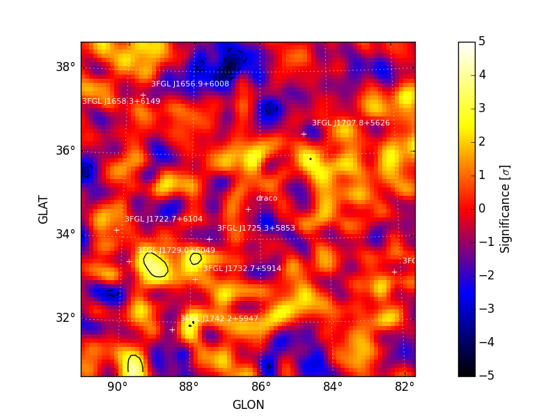
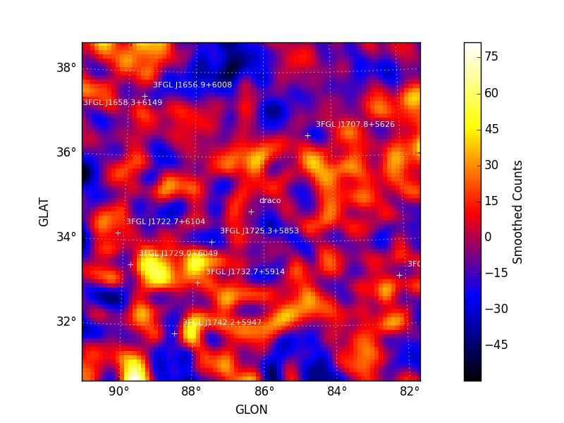
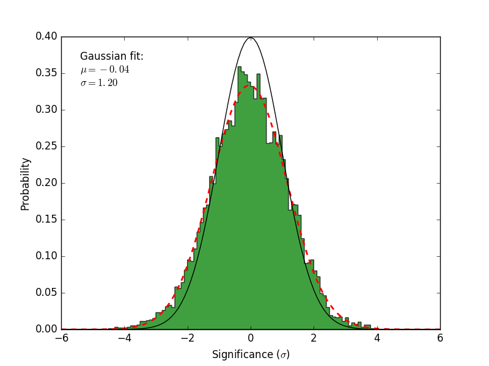

.. _residmap:

Residual Map
============

:py:meth:`~fermipy.gtanalysis.GTAnalysis.residmap` calculates the
residual between smoothed data and model maps.  Whereas a TS map is
only sensitive to positive deviations with respect to the model,
:py:meth:`~fermipy.gtanalysis.GTAnalysis.residmap` is sensitive to
both positive and negative residuals and therefore can be useful for
assessing the model goodness-of-fit.  The significance of the
data/model residual at map position (*i*, *j*) is given by

.. math::

   \sigma_{ij}^2 = 2 \mathrm{sgn}(\tilde{n}_{ij} - \tilde{m}_{ij}) 
   \left(\ln L_{P}(\tilde{n}_{ij},\tilde{n}_{ij}) - \ln L_{P}(\tilde{n}_{ij},\tilde{m}_{ij})\right)

.. math::
   
   \mathrm{with} \quad
   \tilde{m}_{ij} = \sum_{k} (m_{k} \ast f_{k})_{ij} \quad \tilde{n}_{ij} = \sum_{k}(n_{k} \ast f_{k})_{ij}
   \quad \ln L_{P}(n,m) = n\ln(m) - m

where *n*\ :sub:`k` and *m*\ :sub:`k` are the data and model maps at
energy plane *k* and *f*\ :sub:`k` is the convolution kernel.  The
convolution kernel is proportional to the counts expectation at a
given pixel and normalized such that

.. math::

   f_{ijk} = s_{ijk} \left(\sum_{ijk} s_{ijk}^{2}\right)^{-1}
   
where *s* is the expectation counts cube for a pure signal normalized to one.

Examples
--------

The spatial and spectral properties of the convolution kernel are
defined with the ``model`` dictionary argument.  All source models are
supported as well as a gaussian kernel (defined by setting
*SpatialModel* to *Gaussian*).

.. code-block:: python
   
   # Generate residual map for a Gaussian kernel with Index=2.0 and
   # radius (R_68) of 0.3 degrees   
   model = {'Index' : 2.0, 
            'SpatialModel' : 'Gaussian', 'SpatialWidth' : 0.3 }
   maps = gta.residmap('fit1',model=model)

   # Generate residual map for a power-law point source with Index=2.0 for
   # E > 3.16 GeV
   model = {'Index' : 2.0, 'SpatialModel' : 'PointSource'}
   maps = gta.residmap('fit1_emin35',model=model,erange=[3.5,None])

   # Generate residual maps for a power-law point source with Index=1.5, 2.0, and 2.5
   model={'SpatialModel' : 'PointSource'}
   maps = []
   for index in [1.5,2.0,2.5]:
       model['Index'] = index
       maps += [gta.residmap('fit1',model=model)]

:py:meth:`~fermipy.gtanalysis.GTAnalysis.residmap` returns a ``maps``
dictionary containing `~fermipy.skymap.Map` representations of the
residual significance and amplitude as well as the smoothed data and
model maps.  The contents of the output dictionary are described in
the following table.

============= ====================== ======================================
Key           Type                   Description
============= ====================== ======================================
sigma         `~fermipy.skymap.Map`  Residual significance in sigma.
excess        `~fermipy.skymap.Map`  Residual amplitude in counts.
data          `~fermipy.skymap.Map`  Smoothed counts map.
model         `~fermipy.skymap.Map`  Smoothed model map.
files         dict                   File paths of the FITS image
                                     files generated by this method. 
src_dict      dict                   Source dictionary with the
                                     properties of the convolution kernel. 
============= ====================== ======================================

The ``write_fits`` and ``write_npy`` options can used to write the
output to a FITS or numpy file.  All output files are prepended with
the `prefix` argument.

Diagnostic plots can be generated by setting ``make_plots=True`` or by
passing the output dictionary to
`~fermipy.plotting.AnalysisPlotter.make_residmap_plots`:

.. code-block:: python
   
   maps = gta.residmap('fit1',model=model, make_plots=True)
   gta.plotter.make_residmap_plots(maps, roi=gta.roi)

This will generate the following plots:

* ``residmap_excess`` : Smoothed excess map (data-model).

* ``residmap_data`` : Smoothed data map.

* ``residmap_model`` : Smoothed model map.
  
* ``residmap_sigma`` : Map of residual significance.  The color map is
  truncated at -5 and 5 sigma with labeled isocontours at 2 sigma intervals
  indicating values outside of this range.

* ``residmap_sigma_hist`` : Histogram of significance values for all
  points in the map. Overplotted are distributions for the best-fit
  Gaussian and a unit Gaussian.

   

.. csv-table::
   :header: Residual Significance Map, Significance Histogram
   :widths: 50, 50
           
   |image_sigma|, |image_sigma_hist|

Configuration
-------------

The default configuration of the method is controlled with the
:ref:`config_residmap` section of the configuration file.  The default
configuration can be overriden by passing the option as a *kwargs*
argument to the method.

.. csv-table:: *residmap* Options
   :header:    Option, Default, Description
   :file: ../config/residmap.csv
   :delim: tab
   :widths: 10,10,80
   
Reference/API
-------------

.. automethod:: fermipy.gtanalysis.GTAnalysis.residmap
   :noindex:
